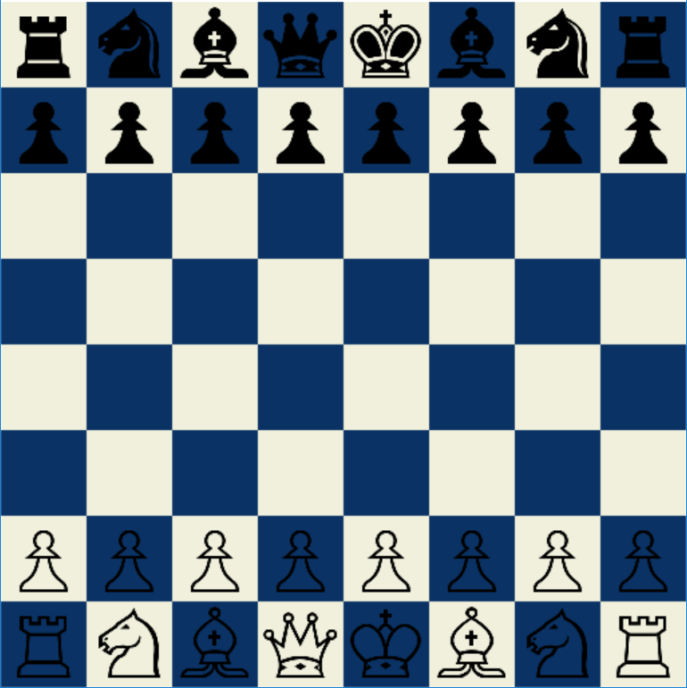

# Chess
Chess in C++ and SDL.

Requires linking SDL2 and SDL2_ttf libraries. If you want to modify this code,make sure to link those libraries to your visual studio solution.

If you just want to see it in action, Download the ```/Release``` folder with all the dll files in it and run chess.exe.

Thank you :smiley:

</img>
## To Do:
* Add Castling
* Add Pawn Promotion
* Add Export to pgn and Algebraic Notation input
* Implement neural network that learns to play chess
* Implement an A.I using Minimax algorithm and alpha-beta pruning
* Add connector for Stockfish(optional?) 
### License
MIT License

Copyright (c) 2019 Shriram Ravindranathan

Permission is hereby granted, free of charge, to any person obtaining a copy
of this software and associated documentation files (the "Software"), to deal
in the Software without restriction, including without limitation the rights
to use, copy, modify, merge, publish, distribute, sublicense, and/or sell
copies of the Software, and to permit persons to whom the Software is
furnished to do so, subject to the following conditions:

The above copyright notice and this permission notice shall be included in all
copies or substantial portions of the Software.

THE SOFTWARE IS PROVIDED "AS IS", WITHOUT WARRANTY OF ANY KIND, EXPRESS OR
IMPLIED, INCLUDING BUT NOT LIMITED TO THE WARRANTIES OF MERCHANTABILITY,
FITNESS FOR A PARTICULAR PURPOSE AND NONINFRINGEMENT. IN NO EVENT SHALL THE
AUTHORS OR COPYRIGHT HOLDERS BE LIABLE FOR ANY CLAIM, DAMAGES OR OTHER
LIABILITY, WHETHER IN AN ACTION OF CONTRACT, TORT OR OTHERWISE, ARISING FROM,
OUT OF OR IN CONNECTION WITH THE SOFTWARE OR THE USE OR OTHER DEALINGS IN THE
SOFTWARE.
